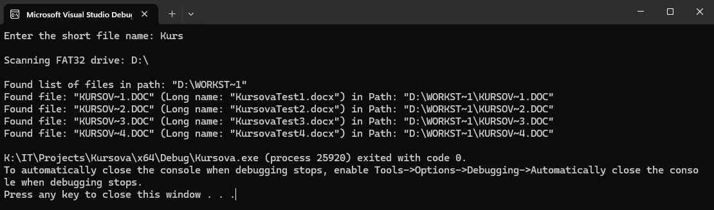
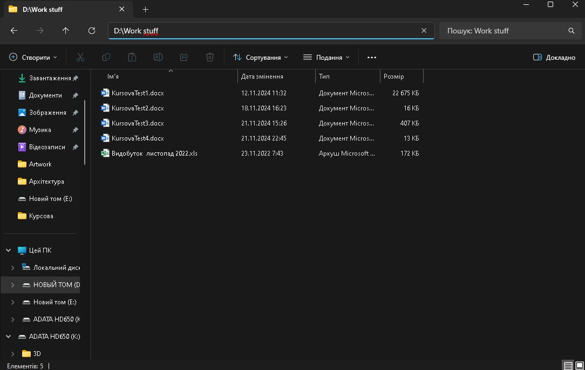

# 📁 ShortToLongFilename

[](https://www.microsoft.com/windows)
[](https://isocpp.org/)
[](https://en.wikipedia.org/wiki/File_Allocation_Table)
[](https://visualstudio.microsoft.com/)

> 🔍 A powerful Windows C++ utility that bridges the gap between FAT32's legacy 8.3 filenames and modern long filenames

A Windows-based C++ program that converts short (8.3) filenames to their corresponding long filenames on FAT32 file systems. This was developed as a coursework project to demonstrate file system operations and Windows API usage.

## 📋 Overview

This program searches for files with short names (8.3 format) on FAT32 drives and displays their full long names along with complete file paths. It's specifically designed to work with FAT32 file systems, which still use the legacy 8.3 naming convention alongside long filenames.

## ✨ Features

- Automatically detects all FAT32 drives on the system
- Recursively searches through directories
- Case-insensitive filename matching
- Displays both short and long filenames
- Shows complete file paths
- UTF-8 console output support

## Requirements

- **Operating System**: Windows only (Windows 7/8/10/11)
- **Development Environment**: Visual Studio (recommended) or any C++ compiler with Windows API support
- **File System**: FAT32 drives
- **Dependencies**: 
  - `windows.h`
  - `Shlwapi.lib`

⚠️ **Important**: This program is designed exclusively for Windows operating systems and utilizes Windows-specific APIs. It cannot run on Linux, macOS, or other operating systems.

## Compilation

### Using Visual Studio (Recommended)
1. Open Visual Studio
2. Create a new C++ Console Application project
3. Replace the default code with the contents of `main.cpp`
4. Build the project (Ctrl + Shift + B)

## 🚀 Usage

1. Run the executable
2. Enter the short filename you want to search for
3. The program will scan all FAT32 drives and display results

```
Enter the short file name: CHEC
```

The program will output:
- All FAT32 drives found on the system
- Matching files with their short and long names
- Complete file paths where matches were found

## 💡 Example Output

```
Scanning FAT32 drive: E:\

Found list of files in path: "E:\ASSETS"
Found file: "CHECK_~1.JPG" (Long name: "check_ifexist.jpg") in Path: "E:\ASSETS\CHECK_~1.JPG"
Found file: "OUTPUT~1.JPG" (Long name: "output.jpg") in Path: "E:\ASSETS\OUTPUT~1.JPG"
```

## How It Works

1. **Drive Detection**: Scans all logical drives and identifies FAT32 file systems
2. **Recursive Search**: Traverses all directories on each FAT32 drive
3. **Short Name Generation**: Uses Windows API to get the 8.3 short name for each file
4. **Pattern Matching**: Performs case-insensitive search for the specified short name
5. **Result Display**: Shows both short and long filenames with full paths

## Project Structure

```
ShortToLongFilename/
├── main.cpp              # Main source code
├── README.md             # 
└── assets/               # Test files for demonstration
```

## Technical Details

The program uses the `FAT32FileSearcher` class which implements:

- `GetFAT32Drives()`: Detects FAT32 file systems
- `FindFiles()`: Main search functionality
- `FindFilesInDirectory()`: Recursive directory traversal
- `ToLowerWString()`: Case-insensitive string comparison
- `IsFAT32Drive()`: File system type verification

## Limitations

- **Windows Only**: Uses Windows-specific APIs
- **FAT32 Only**: Only works with FAT32 file systems
- **Performance**: Large drives may take time to scan completely
- **Permissions**: Requires appropriate file system access rights

## Screenshots

The `assets/` folder contains screenshots demonstrating the program's functionality:

### Console Output

*Screenshot showing the program execution with file search results*

### File Verification

*Screenshot verifying that the files found by the program actually exist on the file system*

These images demonstrate:
- The program successfully finding short filenames and their corresponding long names
- Verification that the files shown in the console output actually exist in the file system
- The complete workflow from input to output on a FAT32 drive

## 🎯 Course Information

This program was developed as a coursework project focusing on:
- File system operations
- Windows API programming
- 8.3 filename conventions
- FAT32 file system characteristics
